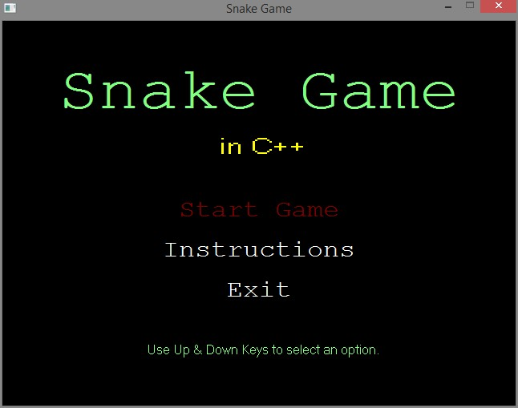
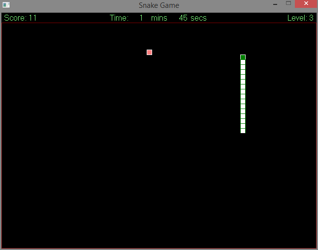
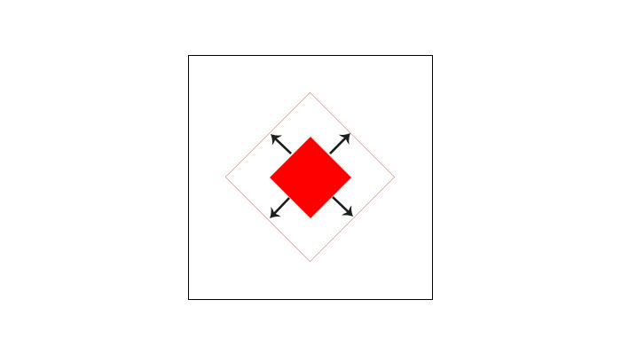

# Snake Game in C++
Snake game created using C++ and the graphics.h library.





## Snake's body created using Doubly Linked List


Logic for displaying the trailing body of the snake.

i)	Traverse the list till the end using next pointer.

ii)	From the last node, traverse back to the head by using previous pointer, while:

    head->x = head->prev->x
    head->y = head->prev->y
    
iii)	Now, we are back to the head node, display the squares by traversing back to the last node through next pointer.

iv)	Repeat the process till game is over, or is complete, or ESC is pressed.

## Forest Fire algorithm for polygon filling


Queue Data Structure implemented using Linked List was used for implementing this algorithm for polygon filling.

```
while(head){
	r = deQueue(&head);
	colorBool = getpixel(r->x, r->y) == colorToRemove;

	if(r){ // i.e Not Null
		putpixel(r->x, r->y, colorToAdd);
	}
	if(colorBool){
		if(!inQueue(head, r->x+1, r->y))
			enQueue(&head, r->x+1, r->y);
		if(!inQueue(head, r->x-1, r->y))
			enQueue(&head, r->x-1, r->y);
		if(!inQueue(head, r->x, r->y+1))
			enQueue(&head, r->x, r->y+1);
		if(!inQueue(head, r->x, r->y-1))
			enQueue(&head, r->x, r->y-1);
	}
	delete r;
}
```
